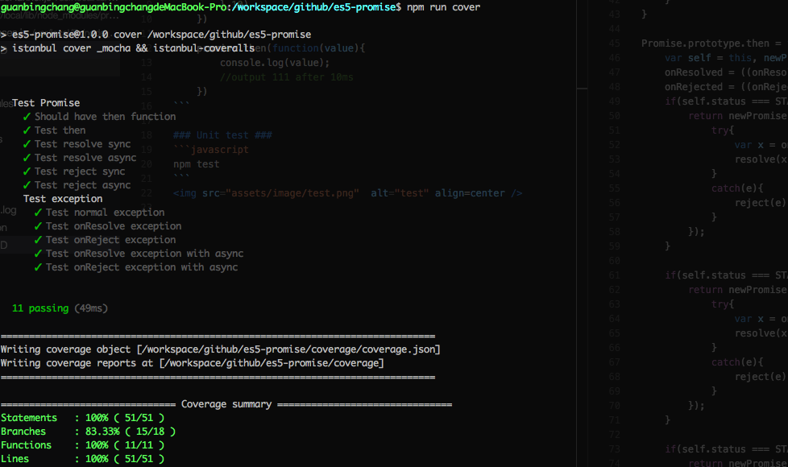

## Example ##


```js
var promise = new Promise(function(resolve,reject){
        setTimeout(function(){
            resolve(111);
            done()
        },10)
    })

    promise.then(function(value){
        console.log(value);
        //output 111 after 10ms
    })
```

### Unit test ###
```javascript
npm test
```

